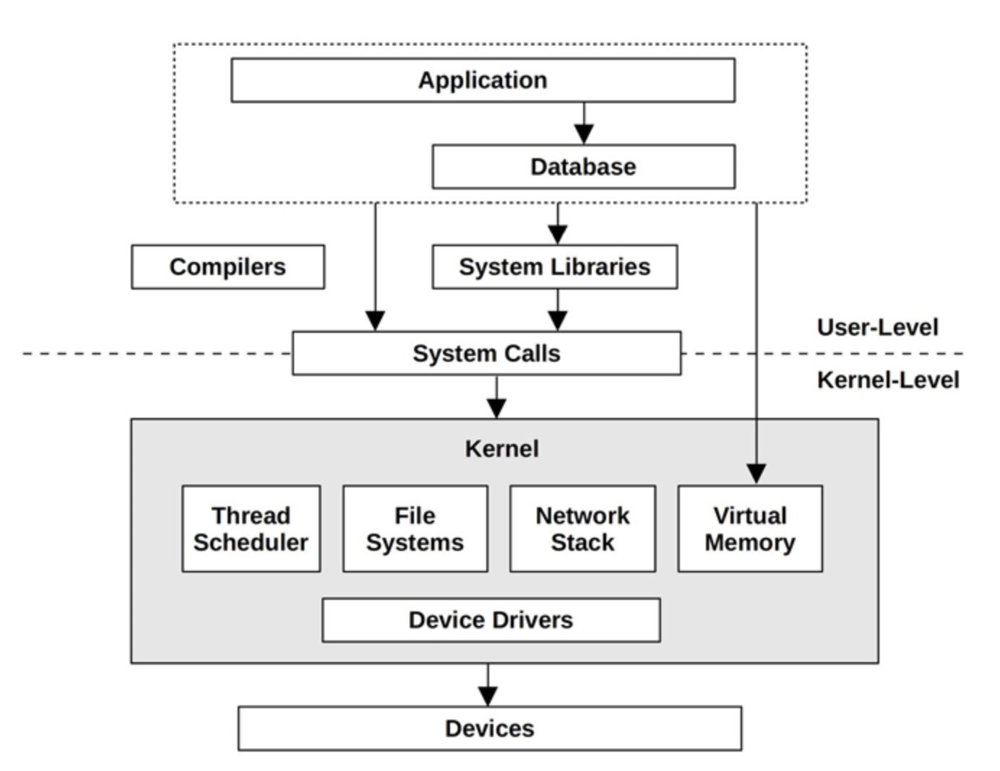

# Chapter 1: Introduction

## Objectives of the Chapter
- Understand System Performance
- Understand observability and experimental tools
- Basic understanding of performance observability
- Learn methodologies

## System Performance

Studies performance of all components (Hardware/Software) in the data path.
Goal is
- improve User Experience
- reduce latencies
- reduce computing cost
- reduce inefficiencies

The typical full stack looks like the diagram below

*Image from System Performance Book, Copyright is with Author*

